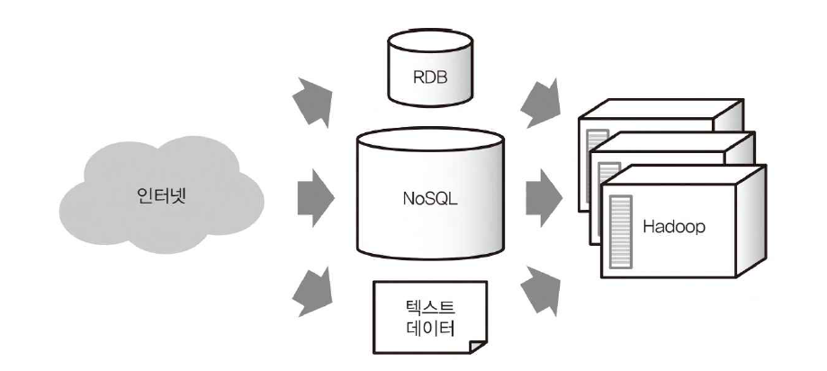

# 2주차-1

**1-1. 빅데이터의 정착**

- ‘빅데이터’에서 적은 노력으로 원하는 정보를 얻을 수 있는 기술의 필요성
- 인터넷의 보급 → RDB로는 취급할 수 없을 만큼 대량의 데이터가 쌓임
- Hadoop과 NoSQL의 대두
    - Hadoop
        - 다수의 컴퓨터에서 대량의 데이터를 처리하기 위한 시스템
        - 수백, 수천 대의 컴퓨터를 관리하는 프레임워크
        - Hive의 도입 → 프로그래밍 없이 데이터를 집계할 수 있게 되어 사용자 확대
    - NoSQL
        - RDB의 제약을 제거하는 것을 목표로 한 데이터베이스
        - 종류
            - key-value store
            - document store
            - wide-column store
        - RDB vs NoSQL
            - RDB보다 고속의 읽기, 쓰기 가능
            - 분산 처리에 뛰어남
        - 애플리케이션에서 온라인으로 접속하는 데이터베이스
- Hadoop과 NoSQL 데이터베이스의 조합
    - NoSQL 데이터베이스에 기록하고 Hadoop으로 분산 처리하기
    - 현실적인 비용으로 데이터를 처리할 수 있게 됨
    
    
    
- Hadoop과 데이터 웨어하우스의 공존
    - 데이터 웨어하우스
        - 데이터 분석을 기반으로 하는 시스템
        - 전국 각지에서 보내진 점포의 매출과 고객 정보 등을 오랜 기간에 걸쳐 축적하고, 이를 분석하여 업무 개선과 경영 판단의 자료로 활용하는 역할
    - 전통적인 데이터 웨어하우스의 단점
        - 일부 데이터 웨어하우스 제품은 안정적인 성능 실현을 위해 HW/SW가 통합된 장비로 제공됨 → 데이터 용량 늘리려면 하드웨어 교체가 필요한 등 확장성에 좋지 않음
    - Hadoop과 데이터 웨어하우스의 활용 방안
        - 가속도적으로 늘어나는 데이터의 처리는 Hadoop에 맡기고, 작은 데이터나 중요한 데이터만을 데이터 웨어하우스에 넣는 식으로 활용
        - 데이터 웨어하우스의 부하를 줄임
        
        
        
- 직접 할 수 있는 데이터 분석 폭 확대
    - 클라우드 서비스의 보급에 의해 빅데이터의 활용 증가
- 데이터 디스커버리
    - 데이터를 시각화하여 가치 있는 정보를 찾는 프로세스
    - 셀프서비스용 BI 도구 → 누구나 데이터를 살펴볼 수 있게 됨
    - Apache Spark vs MapReduce
        - MapReduce는 매 연산 단계마다 데이터를 디스크에 읽고 써서 I/O 비용이 큰 반면, Apache Spark는 데이터를 메모리에 유지하며 처리하기 때문에 처리 속도 훨씬 빠름

**1-2. 빅데이터 시대의 데이터 분석 기반**

- 데이터 파이프라인
    - 차례대로 전달해나가는 데이터로 구성된 시스템
- 데이터 수집
    - 데이터 파이프라인의 시작
    - 데이터의 발생 장소, 형태에 따라 서로 다른 기술로 데이터 전송
    - 데이터 전송 방법
        - 벌크형
            - 이미 어딘가에 존재하는 데이터를 정리해 추출하는 방법
            - 데이터베이스와 파일 서버 등에서 정기적으로 데이터 수집하는 데에 사용
        - 스트리밍형
            - 차례차례로 생성되는 데이터를 끊임없이 계속해서 보내는 방법
            - 모바일 애플리케이션, 임베디드 장비 등에서 널리 데이터 수집하는 데 사용
- 스트림 처리와 배치 처리
    - 스트림 처리
        - 스트리밍 형 방법으로 받은 데이터를 실시간으로 처리
    - 배치 처리
        - 장기적인 데이터 분석을 위한 대량의 데이터 처리에 적합한 구조
- 분산 스토리지
    - 여러 컴퓨터와 디스크로부터 구성된 스토리지 시스템
- 분산 데이터 처리
    - 분산 스토리지에 저장된 데이터를 처리하는 프레임워크
    - 나중에 분석하기 쉽도록 데이터를 가공해서 그 결과를 외부 데이터베이스에 저장하는 역할
    - 분산 스토리지 상의 빅데이터를 SQL로 집계하는 방법
        - 쿼리 엔진 도입
        - 데이터 웨어하우스 제품 이용
            - 분산 스토리지에서 추출한 데이터를 **ETL 프로세스**를 통해 데이터 웨어하우스에 적합한 형식으로 변환
            
            
            
- 워크플로 관리
    - 전체 데이터 파이프라인의 동작을 관리하기 위한 기술
    - 매일 정해진 시간에 배치 처리를 실행, 오류가 발생한 경우에는 관리자에게 통지

- 데이터 웨어하우스와 데이터 마트
    - 데이터 웨어하우스는 대량의 데이터를 장기 보존하는 것에 최적화됨, 따라서 소량의 데이터를 자주 쓰고 읽는 데는 적합하지 않음
    - 데이터 마트
        - 데이터 웨어하우스에서 필요한 데이터만을 추출하여 데이터 분석과 같은 목적에 사용
        - BI도구와 조합시켜 데이터 시각화에도 사용
    - 데이터 웨어하우스 & 데이터 마트 모두 SQL로 데이터 집계함 → 테이블 설계와 ETL프로세스가 중요
        
        
        
        데이터 소스: RDB나 로그 등을 저장하는 파일 서버
        
        ETL 프로세스: 데이터 소스에 보존된 로우 데이터를 추출하고 필요에 따라 가공한 후 데이터 웨어하우스에 저장하기까지의 흐름
        
- 데이터 레이크와 데이터 마트
    - 데이터 레이크
        - 모든 데이터를 원래의 형태로 축적해두고 나중에 그것을 필요에 따라 가공하기 위한 장소
    - 데이터 분석에 필요한 데이터를 가공, 집계하고 이것을 데이터 마트로 추출
    
    
    
- 데이터 엔지니어와 데이터 분석가의 역할 분담

- 애드 혹 분석
    - 일회성 데이터 분석
    - 자동화 등을 생각하지 않고 수작업으로 데이터 집계
    - 데이터 마트를 만들지 않고 데이터 레이크와 데이터 웨어하우스에 직접 연결하는 경우가 많음
- 대시보드 도구
    - 수작업으로 정기적으로 그래프와 보고서를 만들고 싶을 때 도입
    - 데이터 마트가 없이도 동작, 설정한 스케줄에 따라 데이터 레이크와 데이터 웨어하우스에 접속해 쿼리를 실행하고 그 결과로부터 그래프를 생성함
    
    
    
- 데이터 마트와 워크플로 관리
    - 복잡한 데이터 분석에서는 먼저 데이터 마트 구축한 후에 분석하거나 시각화함, 특히 BI도구 사용할 경우는 필수적임
    - 데이터 마트 구축은 배치 처리로 자동화되는 경우가 많기 때문에 그 실행 관리를 위해 워크플로 관리 도구를 사용