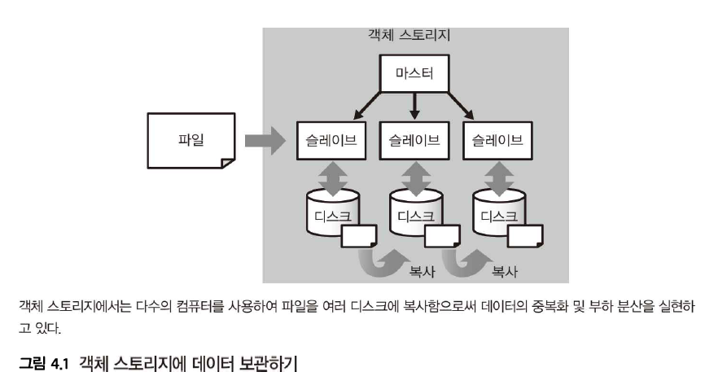

# 2주차-2

**4-1. 벌크 형과 스트리밍 형의 데이터 수집**

- 객체 스토리지
    - 빅데이터 환경에서 대량의 파일을 저장하기 위해 사용하는 확장성 높은 분산 스토리지
    - Hadoop의 **HDFS**, AWS의 **Amazon S3**
- 객체 스토리지의 작동 원리 & 장점
    - 데이터는 항상 여러 디스크에 복사되기 때문에 일부 하드웨어가 고장 나더라도 데이터가 손실되지 않음
    - 데이터의 읽고 쓰기를 다수의 하드웨어에 분산하여  데이터의 양이 늘어도 성능이 떨어지지 않음

- 객체 스토리지 주의사항
    - 작은 파일의 경우, 데이터 양에 비해 통신 오버헤드가 매우 크기 때문에 비효율적
- 객체 스토리지와 파일 크기
    - 시계열 데이터를 수시로 객체 스토리지에 기록할 경우, 대량의 작은 파일이 생성되어 시간이 지남에 따라 성능이 저하됨
    - 작은 데이터는 적당히 모아서 하나의 큰 파일로 만듦으로써 효율을 높임, 큰 데이터는 복수로 나누는 것을 고려
    - 객체 스토리지에서 효율적으로 처리할 수 있는 파일 크기: 대략 1MB~1GB사이
    
    
    
- 데이터 수집
    - 수집한 데이터를 가공하여 집계 효율이 좋은 분산 스토리지를 만드는 일련의 프로세스
    - 데이터 수집, 구조화 데이터 작성, 분산 스토리지에 대한 장기적 저장이 포함됨
- 벌크 형 데이터 전송
    - 데이터베이스, 파일 서버, 웹 서비스 등에서 SQL이나 API 등을 이용해 데이터를 정리하여 추출하는 방식
    - 전통적인 데이터 웨어하우스에서 주로 사용되던 방식으로, 이미 축적된 과거의 대량 데이터가 있거나 기존 데이터베이스에서 데이터를 추출할 때 적합함
    - ETL서버
        - 구조화된 데이터 처리에 적합한 ETL 도구, 오픈 소스 전송 도구, 또는 직접 작성한 스크립트를 이용해 데이터를 전송
            
            
            
    - 파일 사이즈 적정화 전략
        - 여러 개의 파일을 여러 번 보내는 대신, 한 번의 전송에 모든 파일을 포함하도록 변경하여 효율을 높임
        - 데이터양이 많을 때는 한 달이나 하루 단위의 작은 태스크로 분해하여 전송
    - 데이터 전송의 워크플로
        - 벌크 형 데이터 전송은 워크플로 관리 도구와 궁합이 뛰어남
        - 스트리밍 형 전송은 실시간 동작을 전제로 하므로, 워크플로의 일부로 실행하지 않음
        - 과거의 데이터를 빠짐없이 가져오거나 실패한 작업을 재실행할 것을 고려하면 벌크 형 전송을 해야함
- 스트리밍 형 데이터 전송
    - 실시간으로 생성되어 아직 저장되지 않은 데이터의 경우 스트리밍 방식이 필요함
    - 메시지 배송: 다수의 클라이언트에서 계속해서 작은 데이터가 전송되는 방식, 데이터 양에 비해 통신 오버헤드가 커서 서버에 높은 성능이 요구됨
        
        
        
    - 데이터 저장하는법
        - NoSQL 데이터베이스 이용 - Hive와 같은 쿼리 엔진으로 NoSQL 데이터베이스에 연결해 데이터 읽음
        - 중계 시스템에 전송 (메시지 큐, 메시지 브로커) - 일정한 간격으로 꺼내고 모아서 함께 분산 스토리지에 저장함
    - 웹 브라우저에서의 메시지 배송
        - 웹 서버 안에서 메시지를 만들어 배송할 때는 전송 효율을 위해 서버 상에서 일단 데이터를 축적했다가 나중에 모아서 보내기도 함. 이때 **Fluentd**나 **Logstash** 같은 도구가 자주 사용됨
        - 자바스크립트를 사용하여 웹 브라우저에서 직접 메시지 보내기 (웹 이벤트 추적)
        
        
        
    - 모바일 앱으로부터의 메시지 배송
        - MBaaS: 백엔드 데이터 저장소에 저장한 데이터를 벌크 형 도구를 사용해서 꺼냄
        - SDK 활용: 분석 서비스 SDK를 통해 이벤트를 수집. 오프라인 상태일 때 SDK 내부에 데이터를 축적했다가 온라인이 되면 전송함 → 중복 제거 대책이 필요함
    - IoT등의 디바이스로부터의 메시지 배송
        - MQTT가 주로 사용됨
            - Pub/Sub형 메시지 배송
            - 관리자에 의해 메시지를 송수신하기 위한 대화방인 Topic 만들어짐
            - 디바이스가 토픽에 메시지를 전달하는 프로그램을 작성하면 MQTT 브로커가 이를 MQTT 구독자에게 송신함
        
        
        
- 메시지 배송의 공통화
    - 클라이언트: 메시지가 처음 생성되는 기기
    - 프론트엔드: 해당 메시지를 먼저 받는 서버, 클라이언트와의 통신 프로토콜을 제대로 구현하는 역할
    - 프론트엔드가 받은 메시지는 그대로 메시지 브로커로 전송
    - 백엔드가 데이터를 분산 스토리지에 저장하는 등 메시지 브로커 이후의 과정을 담당

**4-2. 메시지 배송의 트레이드 오프**

- 스토리지의 성능 문제
    - 쓰기의 빈도가 증가함에 따라 디스크 성능의 한계에 도달하여 오류 발생 가능성 존재
    - 쓰기 오류 발생하면 클라이언트가 메시지 재전송을 반복 → 더 많은 부하 발생하여 악순환
- 메시지 브로커의 도입
    - 빅데이터의 메시지 배송 시스템에서 데이터를 일시적으로 축적하는 중산층
    - Apache Kafka, Amazon Kinesis
    - push형에서 pull형으로 메시지 배송의 타이밍을 변환
    
    
    
- push 형 vs pull 형
    - push 형: 송신 측의 제어로 데이터를 보내는 방식
        - push형의 메시지 배송은 모두 메시지 브로커에 집중시키고 일정한 빈도로 꺼낸 데이터를 분산 스토리지에 기록
    - pull 형: 수신 측의 주도로 데이터를 가져오는 방식
        - 메시지 브로커로부터 일정한 간격으로 데이터를 취함으로써 적당히 모아진 데이터를 분산 스토리지에 기록 → 파일 사이즈 적정화에 도움
- producer vs consumer
    - 메시지 브로커에 데이터를 push하는 것을 producer, pull하는 것을 consumer
- 메시지 브로커의 필요성
    - 데이터의 총량보다 쓰기 횟수에 의해 데이터베이스 오버헤드 발생
    - 프론트 엔드에서 메시지 브로커에 데이터를 push하고 소비자에서 모아서 pull하면 쓰기 횟수 감소하여 시스템 부하 해결 가능
- 스트림 처리
    - 짧은 간격으로 차례대로 데이터를 꺼내서 처리하는 방식
- 메시지 라우팅
    - 브로커에 저장된 데이터를 여러 소비자에서 읽어 들일 수 있음 → 이를 통해 메시지가 복사되어 데이터를 여러 경로로 분기시키는 것
- 신뢰성 문제
    - at most once
        - 메시지는 한 번만 전송된다. 그러나 도중에 전송에 실패해서 사라질 가능성이 있다.
        - 그러나 데이터의 결손을 피하고자 재전송을 시도함
        - 재전송하는 시스템에서는 at most once 보장하는 것이 어려움
    - exactly once
        - 메시지는 손실되거나 중복 없이 한 번만 전달된다
        - 분단된 두 개의 노드가 있는 경우 그 사이에 코디네이터 존재함. 서로의 정보를 코디네이터에게 전달
        - 그러나 코디네이터 부재의 경우의 합의 문제가 어려움
        - 코디네이터의 판단에만 따르고 있으면 시간이 너무 소요됨
    - at least once
        - 메시지는 확실히 전달된다. 단, 같은 것이 여러 번 전달될 가능성이 있다.
        - 이용자에게 중복 제거를 맡김
    - 중복 제거
        - 오프셋을 이용한 중복 제거
        - 고유 ID에 의한 중복 제거
            - 분산스토리지로 NoSQL 데이터베이스 이용, 동일한 ID의 데이터는 덮어씀
            - SQL로 중복을 제거함 (DISTINCT, GROUP BY)
    - 종단간의 신뢰성
        - 중간 경로에서는 신뢰성보다 효율을 중시하여 at least once를 보장, 중복 제거는 하지 않는 것이 표준적인 구현임
        - 중복 제거란 종단 간에 실행하지 않으면 의미가 없음
        - 중간 경로의 신뢰성을 at least once로 통일한 후 경로의 말단에서 중복 제거를 실행해야 함
- 데이터 수집의 파이프라인
    
    
    
    이 과정은 필요에 따라 생략 가능. 쓰기 성능이 충분하다면 브로커를 빼고 NoSQL에 바로 쓸 수도 있고, 중복이 허용된다면 중복 제거 단계를 건너뛸 수도 있음 
    
- 중복을 고려한 시스템 설계
    - 항상 중복의 가능성이 있다고 생각
    - 아주 작은 중복은 무시하는 경향이 있음
    - 중복이 있어도 문제가 되지 않는 시스템을 설계할 것을 추천
- 메시지 브로커와 신뢰성
    - 메시지 브로커를 사용하면 쓰기 성능이 향상될 뿐 아니라, 후속 처리를 안정화하는 데 도움이 됨
    - 분산 데이터베이스를 점검하느라 중지시켜도, 브로커가 데이터를 받아주므로 데이터 유실이 없음 → 유지보수 용이
    - pull 형 시스템이므로, 어떤 이유로 데이터를 다시 처리하고 싶을 때 일정 기간 내의 과거 데이터를 몇 번이고 다시 가져올 수 있음