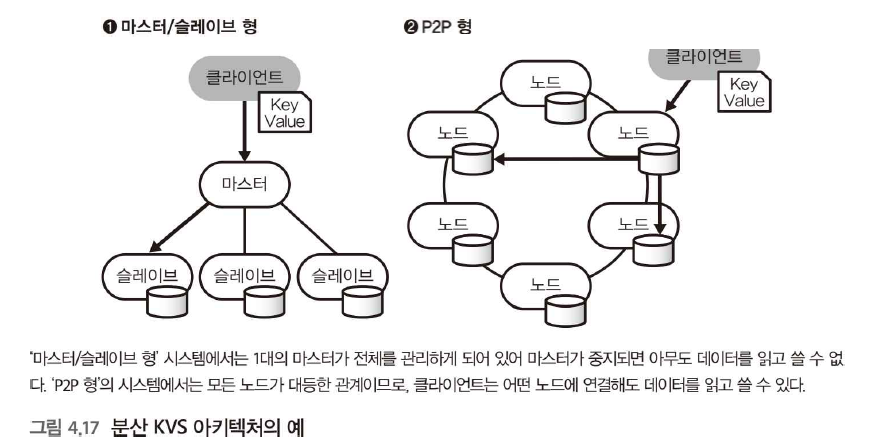

# 3주차

- 객체스토리지의 한계
    - 파일 교체가 어려워서 수시로 변경할 수 없음 → 쓰기 빈도 높은 데이터는 별도 RDB에 저장하고 정기적으로 스냅샷 하거나 다른 분산 데이터베이스에 저장하도록 함
    - 객체 스토리지에 저장된 데이터를 집계할 수 있게 되기까지는 시간이 걸림, 데이터 기록하고 곧바로 활용하고자 하는 경우에는 실시간 집계와 검색에 적합한 데이터 저장소 필요
- NoSQL 데이터베이스
    - 특정 용도에 최적화된 데이터 저장소
- 분산 KVS
    - 모든 데이터를 키값 쌍으로 저장하도록 설계된 데이터 저장소
    - 몇 KB 정도의 작은 데이터를 초당 수만 번씩 매우 빈번하게 읽고 쓰는 고성능 처리에 최적화됨
    - 작동 원리
        - 모든 데이터에 키를 지정하고 이를 부하 분산을 위해 이용
        - 키가 정해지면 값을 클러스터 내의 어느 노드에 배치할 것인지 결정
        - 가장 기본적으로는 '1개의 키에 1개의 값'을 할당하지만, 시스템 구현 방식에 따라 '1개의 키에 여러 값'을 넣거나 '여러 키의 조합으로 값을 찾는' 등 다양하게 구성할 수 있음
    - 아키텍처 유형
    
    
    
    - Amazon DynamoDB
        - 기본적으로는 키-값 구조지만, JSON과 같은 중첩된 데이터도 저장할 수 있어 도큐먼트 스토어처럼 활용 가능
        - P2P 형 아키텍처를 채택하여 사용자가 설정한 초당 요청 수에 따라 노드가 자동으로 증감하여 성능을 유지
        - 데이터 분석 방법
            - 배치 처리: Amazon EMR (Hive 등)과 결합하여 대량 데이터를 처리.
            - 데이터 웨어하우스: Amazon Redshift로 데이터를 전송하여 분석.
            - 실시간 처리: DynamoDB Streams 기능을 켜서 데이터 변경 사항을 이벤트로 Amazon Kinesis 등에 보내 실시간 스트림 처리.
- ACID vs CAP
    - 일반적인 RDB는 트랜잭션의 ACID 특성을 보장함
    - 분산 시스템은 CAP 정리에 따라, 보통 일관성을 일부 희생하고 가용성과 성능을 선택
- 와이드 칼럼 스토어
    - 분산 KVS를 발전시켜 2개 이상의 임의의 키에 데이터를 저장할 수 있도록 한 것
    
    
    
    - Apache Cassandra
        - ‘CQL’ 이라는 쿼리 언어 사용
        - 복합 키 활용
- 도큐먼트 스토어
    - 데이터 처리의 유연성이 목적
    - 스키마리스 데이터를 그대로의 형태로 저장하고 쿼리 실행할 수 있도록 함
    - MongoDB
        - 성능을 우선하고 신뢰성을 희생하여 간편함
- 검색 엔진
    - 검색 엔진은 텍스트 데이터나 스키마리스 데이터를 집계하는 데 자주 사용됨
    - 역 색인을 만드는 특징이 있음
    - 역 색인 작동 원리
        1. 데이터 저장 시: 문장에 포함된 단어들을 토큰화
        2. 매핑: 단어 A -> 문서 1, 문서 3, 단어 B -> 문서 2 형태로 지도를 만듦
        3. 검색 시: 전체 데이터를 뒤지는 것이 아니라, 만들어 둔 지도에서 '단어 A'만 딱 찾아내어 연결된 문서 번호(1, 3)를 즉시 반환함
            
            역 색인이 없으면 원하는 단어 하나를 찾기 위해 모든 데이터를 전체 스캔해야 함,
            
            검색 엔진은 이 역 색인을 만드는 데 특화되어 있어, 텍스트 검색 성능을 비약적으로 높여줌.
            
        - Elasticsearch
            - 일반적인 데이터베이스는 데이터를 그냥 저장하지만, Elasticsearch는 데이터를 넣자마자 나중에 빨리 찾을 수 있도록 모든 항목에 대해 색인을 만듦
            - 그러나 이 목차 만들기 작업 때문에 데이터를 저장할 때 컴퓨터가 일을 많이 해야 해서 속도가 느려지거나 부하가 걸림
            - 모든 항목을 검색할 필요가 없다면, 설정을 변경해서 목차 만들지 않을 데이터를 지정해야 함
            - 데이터를 통계 내거나 분석하는 기능은 좋음
            - 하지만 그 기능을 쓰기 위한 쿼리 문법이 사람이 직접 타이핑하기에는 너무 복잡함
            - 직접 쿼리를 짜지 않고 kibana 같은 시각화 도구를 쓰거나 프로그램 코드를 통해서 사용하기
        - Splunk
            - 복잡한 형식이 없는 비정형 텍스트 데이터를 다루는 데 특화되어 있어, 장애가 발생했을 때 키워드 검색으로 원인을 빠르게 찾거나 일일 보고서를 만드는 데 주로 쓰임
            - 일단 텍스트를 저장해두고, 나중에 쿼리를 날릴 때 정규표현식 등을 이용해 필요한 필드를 즉석에서 뽑아냄
        

---

### NoSQL이 쓰기가 빠른 이유와 LSM Tree 동작 원리 정리

NoSQL이 RDB보다 쓰기 성능이 월등히 빠른 이유는 근본적인 자료구조와 디스크 I/O 방식이 다르기 때문임

### RDB vs NoSQL 쓰기 성능의 차이

데이터베이스의 쓰기 속도는 디스크의 헤드가 얼마나 움직이느냐에 달려 있음

### 1. RDB

RDB는 데이터의 물리적 정렬 상태를 엄격하게 유지해야 함

- 데이터를 쓸 때, 그 데이터가 들어가야 할 정확한 페이지 위치를 디스크에서 찾아야 함 → Random I/O 발생
- 만약 데이터를 넣을 페이지가 꽉 차 있다면, 페이지를 쪼개고 트리 구조를 재조정해야 함 →  구조 변경 비용 발생 → 쓰기 성능의 한계

### 2. NoSQL

LSM Tree는 데이터를 정렬된 상태로 파일에 바로 쓰지 않고, 로그를 쌓듯이 기록함

- 기존 파일의 위치를 찾거나 수정하지 않고, 무조건 새로운 파일 끝에 데이터를 이어 쓰기만 함
- 디스크 헤드가 위치를 찾기 위해 움직일 필요가 없음 → Random I/O 제거

---

### LSM Tree의 쓰기 프로세스, 유실 방지 안전장치

NoSQL: 메모리에 먼저 쓴다 → 데이터 유실 위험 존재 → WAL로 데이터 유실 방지 

### 1. WAL (Write Ahead Log)

- 사용자 요청이 들어오면 MemTable에 넣기 전에 가장 먼저 디스크의 로그 파일에 데이터의 저장 명령이 들어왔다고 기록
- 디스크에 쓰지만, 위치를 찾지 않고 끝에 붙이는 방식이라 매우 빠름
- 서버 전원이 꺼져 메모리가 날아가도, 재부팅 시 WAL을 다시 실행하여 데이터를 복구
- 추후 메모리가 꽉 차서 디스크에 SSTable 저장되면 시스템은 오래된 WAL 파일을 삭제

### 2. MemTable 쓰기

- WAL 기록 후, 실제 데이터는 RAM에 있는 MemTable에 씀
- 메모리 작업이므로 속도가 매우 빠름 데이터는 이곳에서 Key 순서대로 정렬됨

### 3. 디스크 저장

- MemTable이 가득 차면, 이를 그대로 디스크로 내려 SSTable 이라는 불변 파일로 만듦

---

### 읽기 성능 최적화

읽을 때는 수많은 SSTable 파일을 다 뒤져야 함

Bloom Filter라는 자료 구조 → 이 데이터가 집합에 속해있는지 판별 → 모든 SSTable 파일을 다 열어보지 않아도 됨

### Bloom Filter

- 작동 원리
    - 초기값을 0으로 한 N비트 크기 배열 사용
    - 데이터가 들어오면 → 데이터 를 해시 함수들에 통과시켜 나온 인덱스 위치의 배열의 비트를 모두 1로 셋팅
    - 이후 데이터가 있는지 검색할 때 → 데이터를 해시 함수들에 통과시켜 나온 비트가 모두 1인지 확인하기
    - 0이 하나라도 있다? → 100% 없음
    - 모두 1이다? → 있을 수도 있음→ 이때만 실제로 디스크 확인
- 불필요한 디스크 접근을 90% 이상 줄임

---

### 디스크 관리와 정리

계속해서 새로운 SSTable 파일 생성하면 디스크가 꽉 차고 읽기 속도가 느려짐

이를 주기적으로 청소하는 작업이 필요 ⇒ Compaction

### Compaction이 하는 일

1. 병합 
- 작은 SSTable 파일 여러 개를 읽어서, 하나의 큰 파일로 합침 ( 읽을 때 작은 파일 여러개를 뒤지는 것보다, 정리된 하나를 뒤지는 것이 훨씬 빠르기 때문)
1.  최신 데이터 유지
- 같은 Key에 대해 여러 데이터가 있다면, 가장 최신것만 남기고 나머지는 버리기
1. 물리적 삭제 
- 여러 SSTable 파일에서 같은 ID의 데이터를 다 꺼내기
- 그중 타임스탬프가 가장 최신인 것이 무엇인지 봄
- 최신 데이터가 삭제 표시가 되어있다면 → 기존 파일들을 디스크에서 완전히 삭제