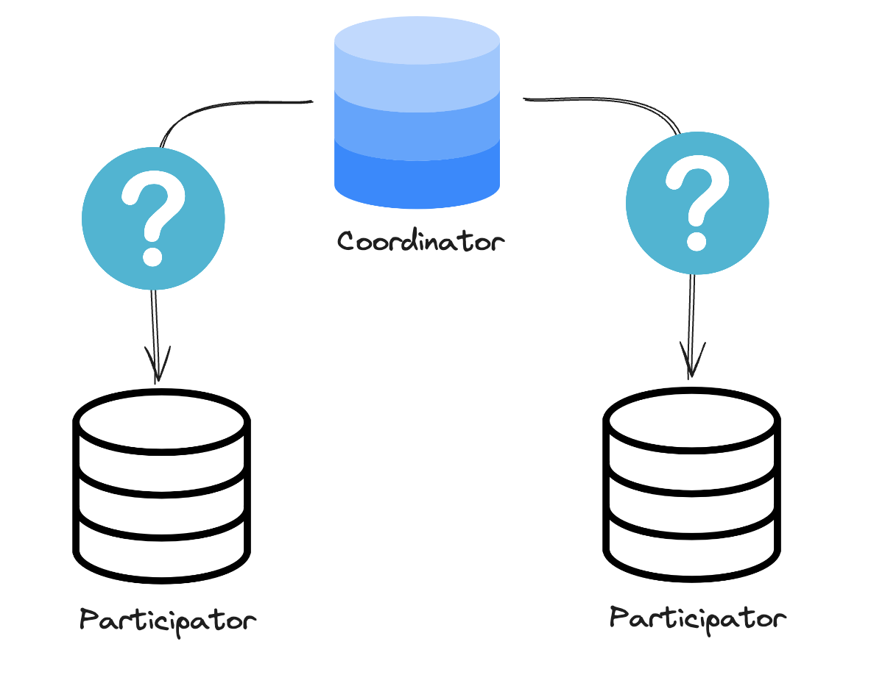

> 4주차 분량
> 
> 
> > 분산 컴퓨팅 1장(12p-21p), 2장(23p-41p)
> > 

# 2PC의 단점 / 보완 / 대안(3PC, Saga)

## 2PC(Two-Phase Commit) 간단 개요

> 2PC는 **코디네이터**와 여러 **참여자**가 참여하는 트랜잭션에서, **두 단계(준비 → 커밋/중단)**를 거쳐 전체 트랜잭션의 결과를 결정하는 방식이다.
> 

**1단계(Prepare, 준비 단계)**

- 코디네이터가 각 참여자에게 “커밋 가능?”을 묻고, 참여자는 가능/불가능(YES/NO)로 응답한다.

**2단계(Commit 단계)**

- 코디네이터가 1단계 응답을 바탕으로 전체를 **커밋 또는 중단**으로 결정해 전파한다.

또한 트랜잭션이 끝날 때까지 **락을 잡아** 커밋 전의 중간 상태가 다른 요청에 보이거나 건드려지는 걸 막는다.

****락(lock)** = 다른 트랜잭션이 못 건드리게 데이터에 거는 잠금* 

- 예시
    - A→B 이체 진행 중: A 출금은 반영됨, B 입금은 아직X
    - 누군가 **그때 잔액을 조회**하면 중간 상태를 볼 수 있음
    - 그래서 락으로 커밋 전에는 접근(조회/수정)을 막고, 커밋 후 결과만 보게 함

---

# 1) 2PC의 문제(단점)

## 단점1. 코디네이터가 멈추면 전체가 멈출 수 있다(Blocking)

     블로킹(blocking) = 결정을 못 받아서 트랜잭션/참여자가 멈춰서 기다리는 상태* 

> 2PC에서 제일 큰 문제는 **준비 단계(Prepare)가 끝난 뒤에 코디네이터가 장애 나는 상황**이다.
> 
- 참여자들이 “YES(커밋 가능)”라고 답하면, 이제 최종 결정은 **코디네이터가 내려야** 한다.
- 그런데 그 타이밍에 코디네이터가 멈추면, 참여자들은 **커밋할지 중단할지**를 못 정하고 계속 기다린다.
    
    → 이 상태를 **의심 상태(in doubt)** 또는 **불확실 상태(uncertain)**라고 한다.
    
- 문제는, 기다리는 동안 참여자들이 잡고 있던 **락이 계속 유지**된다는 점이다.
    
    그러면 다른 요청들도 같이 막히면서 시스템이 **버벅이거나 멈춘 것처럼** 보일 수 있다.
    

한 줄로 정리하면:

**준비 단계 이후 코디네이터 장애 → 참여자 결정 못 함 → 계속 대기 → 락 유지 → 가용성(잘 동작하는 정도) 저하**

---

## 단점2. 코디네이터 로그가 깨지면 “안 풀리는 트랜잭션”이 남을 수 있다

> 코디네이터가 중단되었다가 복구되면 보통 **트랜잭션 로그**를 보고 “이건 커밋이었는지, 중단이었는지”를 확인해서 정리한다.
> 

- 그런데 코디네이터의 트랜잭션 로그가 일부라도 **손상**되면,
- 기다리던 트랜잭션이 제대로 정리되지 못하고 **락된 채로 남아버릴 수 있다.**
    
    (이런 트랜잭션을 고아 트랜잭션이라고 부름)
    
- 이런 경우에는 단순히 DB를 재시작하는 것만으로는 해결이 안 될 수도 있다.

---

## 단점3. 성능이 느려지기 쉽다(오버헤드가 크다)

> 2PC는 안전하게 처리하는 대신 비용이 크다.
> 

1. **통신이 많이 필요함**
    - 코디네이터와 참여자 사이에 **왕복 통신이 2번** 필요하다.

1. **디스크 작업이 많음**
    - 코디네이터와 참여자가 단계마다 **로그를 디스크에 저장**해야 한다.
    - 특히 코디네이터는 커밋 로그를 디스크에 확실히 기록해야 끝난다.

1. **참여자가 많아질수록 더 느려짐**
    - 참여자가 늘면 메시지도 늘고, 지연도 늘어난다.
    - 결국 전체 속도는 **가장 느린 참여자**에 맞춰진다.
        - 예시
            
            참여자가 100개일 때, 
            
            **99개가 0.1초** 만에 응답해도 **1개가 5초** 걸리면 **전체 트랜잭션은 5초**가 된다.
            
            → 전체 속도는 “가장 느린 참여자”에 맞춰진다.
            

---

# 2) 2PC를 유지하면서 완화하는 방법(보완)

## 2-1. 휴리스틱 결정(Heuristic decision)

> 휴리스틱 결정은, **참여자가 코디네이터 응답을 너무 오래 못 받으면** 더 이상 기다리지 않고 **스스로 커밋/중단을 결정**하는 방식이다.
> 

- 장점: 의심 상태로 오래 대기하면서 **락을 계속 잡는 상황을 풀어** 가용성 저하를 줄일 수 있다.
- 단점: 코디네이터의 실제 결정과 다를 수 있어 **원자성을 완전히 보장하지 못하고 데이터 불일치가 생길 수 있다.**
- 그래서 보통은 **휴리스틱 커밋은 피하고 휴리스틱 중단만 허용**하는 경우가 많다.
    
    (커밋은 되돌리기 어렵지만, 중단은 나중에 재시도할 수 있기 때문)
    

---

## 2-2. 코디네이터 이중화

> 코디네이터 이중화는 **코디네이터가 죽어도 다른 노드가 이어받게** 코디네이터 상태를 복제해 두는 방식이다.
> 

- 이를 위해 코디네이터들끼리 **트랜잭션 로그를 공유/복제**해야 한다.
- 또 동시에 여러 코디네이터가 결정을 내리면 안 되므로, 대표 코디네이터를 하나 정해야 한다.
- 결과적으로 blocking을 줄일 수는 있지만, 챙겨야 할 게 많아져서 **단순 2PC보다 설계하고 운영하기가 더 어렵다.**

---

# 3) 2PC를 대체하는 방법(대안): 3PC / Saga

## 3-1. 3PC(Three-phase commit)

- 3PC는 2PC의 **블로킹 문제**를 줄이려고 나온 방식
- 2PC에  **PreCommit  단계를 추가**해서, **CanCommit? →  PreCommit  → DoCommit** 총 3단계로 진행된다.

### Q. PreCommit 단계가 왜 들어갈까?

- 모든 참여자에게서 “YES(커밋 가능)”를 받으면, 코디네이터는 참여자들에게 **PreCommit** 메시지를 보낸다.
- 이 메시지를 받은 참여자는 **커밋 준비 완료 상태(prepared)**가 된다.
    - 로컬 트랜잭션을 디스크 로그에 기록하고
    - 커밋해야 한다는 사실을 저장한 뒤
    - 코디네이터에게 ACK를 보낸다.
- 그래서 만약 그 다음에 코디네이터가 장애가 나더라도, 참여자들이 서로 상태를 확인해서 **DoCommit**으로 갈 수 있게 설계되어 있다.

### Q. 3PC는 왜 현실에서 잘 안 쓰일까?

3PC는 “이렇게만 된다면 블로킹을 줄일 수 있다”는 **가정**이 깔려 있다.

- 네트워크 지연이 예측 가능하고 크지 않다
- 노드도 항상 일정 시간 안에 응답한다

하지만 실제로는 네트워크가 갑자기 지연이 길어질 수 있고, 그럴 때 진짜 장애인지, 단순 지연인지 판단하기 어렵다.

그래서 3PC는 **아이디어 자체는 괜찮지만**, 실제 시스템에서는 잘 쓰이지 않는다.

---

## 3-2. Saga

Saga는 2PC처럼 “모든 걸 한 번에 같이 커밋”하려고 하기보다는, 하나의 큰 트랜잭션을 여러 단계로 나눠서 처리하는 방식이다.

- 단계별 트랜잭션이 성공하면 다음 단계로 넘어간다.
    - 1단계가 성공하면 2단계 → 2단계가 성공하면 3단계
- 중간에 실패하면, 이미 끝난 단계들은 되돌리기 작업(undo)을 따로 실행해서 전체 흐름을 맞춘다.
- 그래서 2PC처럼 “한 번에 전부 성공/실패가 같이 결정되는 방식”은 아니다.
- 이런 방식은 DB가 알아서 해주는 게 아니라, 보통 애플리케이션 **쪽에서 순서를 관리**해서 분산 환경에서 많이 쓰인다.